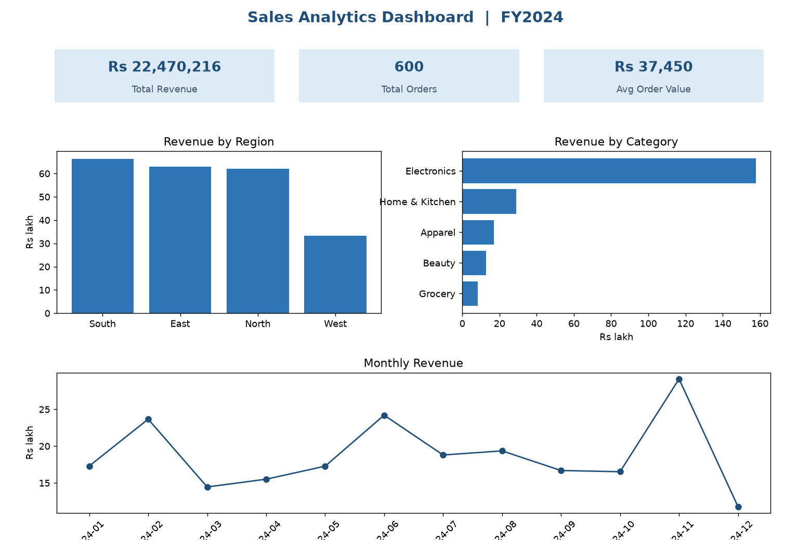

# Sales Analytics Dashboard (Excel)

A self-taught practice project that takes a messy sales export all the way to a clean Excel dashboard - showing the full workflow: **clean -> validate -> analyse -> visualise**. The emphasis is on data accuracy and documented, repeatable cleaning, which is the part of analytics that decides whether the final numbers can be trusted.

## The dashboard

The workbook is [`sales_dashboard.xlsx`](sales_dashboard.xlsx): a `Data` sheet with the 600 cleaned orders, and a `Dashboard` sheet with KPI cards, summary tables, and three charts - revenue by region, revenue by category, and the monthly trend.

## What's inside

| File | What it is |
|---|---|
| [`sales_dashboard.xlsx`](sales_dashboard.xlsx) | The finished dashboard workbook |
| [`data/raw_sales_data.csv`](data/raw_sales_data.csv) | The messy source: mixed date formats, currency symbols in numbers, inconsistent text, blanks, duplicates |
| [`data/cleaned_sales_data.csv`](data/cleaned_sales_data.csv) | The cleaned dataset - 600 unique orders |
| [`docs/data-cleaning-steps.md`](docs/data-cleaning-steps.md) | Every problem in the raw data and exactly how it was fixed |
| [`docs/build-guide.md`](docs/build-guide.md) | How the dashboard is put together: tables, formulas, charts |
| [`docs/insights.md`](docs/insights.md) | The findings and control figures |

## Headline results

- **Total revenue:** Rs 2,24,70,216 across 600 orders
- **Average order value:** Rs 37,450
- **Biggest finding:** Electronics drives **70%** of revenue (a concentration risk), and the **West region underperforms** at roughly half the revenue of each other region.

Full breakdown in [`docs/insights.md`](docs/insights.md).

## Skills this shows

- Cleaning messy real-world data: date standardisation, stripping currency formatting, de-duplication, handling blanks without losing rows.
- Validating cleaned data against control totals before trusting it.
- Building summary tables and charts into a one-page dashboard layout.
- Turning numbers into a short, decision-focused read.

---

*Self-taught practice project by Anuradha Rani. The dataset is synthetic; this is independent practice, not client work.*
